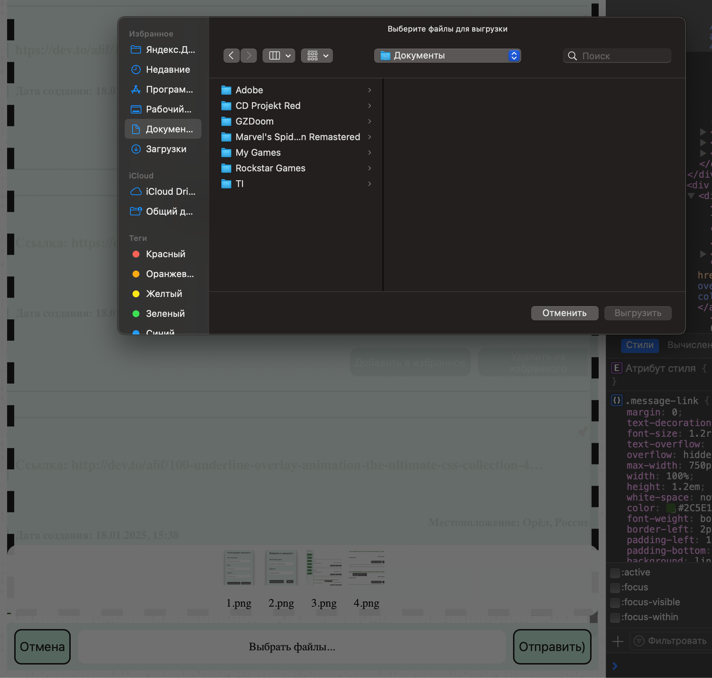

# Дипломное задание к курсу «Продвинутый JavaScript в браузере». Chaos Organizer
---

Сервер выложен на onRender.

[Ссылка на сервер onRender](https://ahj-diploma-backend-kgk7.onrender.com/)

[Ссылка на Github Pages](https://artkonx.github.io/ahj-diploma-frontend/)

[Ссылка на backend репозиторий](https://github.com/ArtKonX/ahj-diploma-backend/)

###### tags: `netology` `advanced js in html`

## Легенда

Мы всё больше привыкаем к неформальному формату организации информации, где ключевое — не структура, а удобство и поиск. Примеры: Slack, Telegram, WhatsApp, вплоть до помощников типа Siri или Алиса.

## Основная концепция

Ключевая идея — создать бота, предназначенного для хранения информации, поиска и других сервисов: напоминания, уведомления и интеграции с внешними сервисами.

Назовём это глобальным ботом-органайзером: вы закидывате туда всю информацию, которая вам нужна, а он сортирует, обеспечивает поиск, хранение и напоминание.

### Обязательные для реализации функции:

* сохранение в истории ссылок и текстовых сообщений; ✅

Для того чтобы файлы, видео, аудио, ссылки, текстовые сообщения сохранялись на каждого пользователя свои и чтобы все фильтровалось и выдавалось в соответствии с этим, было решено сделать регистрацию и авторизацию для юзера, который уже зарегистрировался.

Скриншот на регистрацию:

Скриншот на авторизацию:

Сохранение в истории ссылок и текстовых сообщений полностью работает для каждого пользователя.

* ссылки (`http://` или `https://`) должны быть кликабельны и отображаться, как ссылки; ✅

Кликабельно и отображается как тег  c href с заданным путём.

* сохранение в истории изображений, видео и аудио (как файлов) — через Drag & Drop и через иконку загрузки; ✅

Чтобы перейти на отправку файлов нужно нажать на эту кнопку.

Файлы при повторном выборе просто добавляются к тем, что мы уже
добавили, но если их больше 5, то появляется подсказка, и удаляется все что мы добавили.

Через Drag & Drop:

Предпросмотр:

И через кнопку "Выбрать файлы..."

Полностью работает сохранение в истории изображений, видео и аудио и файлов.

* скачивание файлов на компьютер пользователя; ✅

* ленивая подгрузка: сначала подгружаются последние 10 сообщений, при прокрутке вверх подгружаются следующие 10 и т. д. ✅
  Все работает для каждой категории, в меню справа при прокрутке наверх страницы.

### Дополнительные для реализации функции:

* синхронизация: если приложение открыто в нескольких окнах или вкладках, то контент должен быть синхронизирован; ✅

Все полностью синхронизировано вплодь до закрпленного сообщения, для юзера в нескольких окнах или вкладках, только для одной категории, но если у нас разные аккаунты это не работает.

* отправка геолокации; ✅

При отправке сообщений отправляется геолокация, которая записывается в localStorage(если разрешения геолокации нет отправляется сообщение 'Не найдено Дайте разрешение браузеру')

* воспроизведение видео/аудио, используя API браузера; ✅

Всё полностью воспроизводится:

❗Ошибку я исправил в коде(заменил слово аудио на видео в компоненте).

* отправка команд боту: `@chaos: погода`, бот должен отвечать рандомным прогнозом погоды, интегрироваться с реальными сервисами не требуется, команд должно быть не менее 5; ✅

Все команды @chaos: погода', '@chaos: слово', '@chaos: песня', '@chaos: доллар', '@chaos: магическая цитата'

* закрепление (pin) сообщений: закреплять можно только одно сообщение, оно прикрепляется к верхней части страницы: ✅

* добавление сообщения в избранное, должен быть интерфейс для просмотра избранного; ✅

## Требования к оформлению

### Визуальное оформление

Мы не ограничиваем вас в визуальном оформлении. Но оно должно быть таким, чтобы человек, знакомый с Telegram, WhatsApp или Slack, без труда смог разобраться и в вашем приложении.

### Техническое оформление

Всё должно быть оформлено в виде публичного репозитория на GitHub.

Для Frontend обязательно: Webpack, Babel, ESLint и AppVeyor для развёртывания.

Клиентская часть должна быть выложена на GitHub Pages. Не забудьте разместить бейджик сборки и ссылку на развёрнутое приложение либо вместе с серверной на Heroku.

### Документация

Обязательно должен быть файл README.md, в котором описано, какие функции вы реализовали и как ими пользоваться (в картинках).

**Важно**: если функция не описана, она будет считаться отсутствующей.